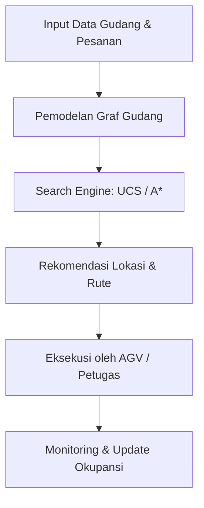
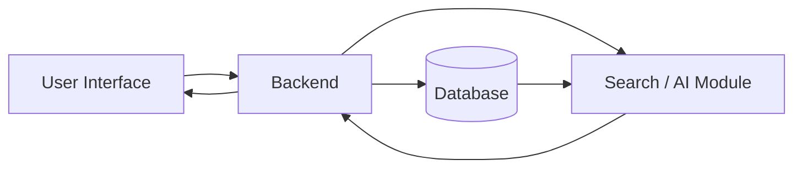

# Smart Warehouse Agent

## Sistem Cerdas untuk Optimasi Penyimpanan dan Pengambilan Barang pada Gudang

[](https://www.python.org/)
[](https://docs.astral.sh/uv/)
[](LICENSE)
[](#roadmap)

Smart Warehouse Agent adalah sistem berbasis Artificial Intelligence yang membantu pengelola gudang menentukan lokasi penyimpanan barang yang optimal (*put-away*) serta rute pengambilan barang yang paling efisien (*retrieval*). Sistem ini dirancang sebagai proyek AI mahasiswa selama satu semester dan masih dikembangkan secara bertahap.

## Daftar Isi

- [Deskripsi Project](#deskripsi-project)
- [Tujuan Project](#tujuan-project)
- [Problem Statement](#problem-statement)
- [AI Approach / Intelligent System](#ai-approach--intelligent-system)
- [PEAS](#peas)
- [Fitur Utama](#fitur-utama)
- [System Workflow](#system-workflow)
- [System Architecture](#system-architecture)
- [Roadmap](#roadmap)
- [Struktur Project](#struktur-project)
- [Instalasi](#instalasi)
- [How to Run](#how-to-run)
- [Contoh Use Case](#contoh-use-case)
- [Future Development](#future-development)
- [Team](#team)
- [License](#license)

## Deskripsi Project

Pengelola gudang sering menangani penempatan dan pengambilan barang berdasarkan pengalaman staf secara manual, tanpa mempertimbangkan jarak tempuh, kepadatan lorong, atau karakteristik barang secara sistematis. Kondisi ini dapat menyebabkan ruang penyimpanan tidak termanfaatkan secara optimal, waktu pengambilan barang menjadi lama, dan risiko kesalahan penempatan meningkat.

Smart Warehouse Agent memodelkan gudang sebagai graf berbobot — node merepresentasikan titik pada peta gudang (dock penerimaan, persimpangan lorong, slot rak), sedangkan edge merepresentasikan jarak/waktu tempuh riil antar-titik. Di atas model ini, agen cerdas menjalankan algoritma pencarian ruang keadaan (state-space search) untuk menentukan lokasi penyimpanan optimal dan rute pengambilan barang berbiaya minimum.

Project ini bukan sekadar sistem pencatatan stok (WMS konvensional). Unsur kecerdasannya terletak pada formulasi masalah sebagai pencarian pada graf serta algoritma yang digunakan untuk menemukan keputusan penyimpanan dan rute yang optimal secara terukur.

## Tujuan Project

- Meminimalkan jarak/waktu tempuh pada proses put-away dan picking barang.
- Memaksimalkan tingkat utilisasi ruang penyimpanan gudang.
- Mengurangi kesalahan penempatan dan pengambilan barang akibat keputusan manual.
- Menyediakan baseline algoritma pencarian (UCS & A*) sebagai fondasi optimasi keputusan penyimpanan dan rute.
- Membuka peluang pengembangan ke arah prediksi permintaan dan slotting adaptif pada milestone berikutnya.

## Problem Statement

Permasalahan yang ingin dibantu oleh Smart Warehouse Agent meliputi:

- Utilisasi ruang rak rendah karena barang sering ditempatkan di slot yang tidak sesuai kategori/ukurannya.
- Waktu pengambilan barang (picking time) tinggi karena barang fast-moving tidak selalu berada di lokasi strategis.
- Kesalahan pencatatan lokasi barang meningkatkan risiko selisih stok (stock discrepancy).
- Keputusan penyimpanan bersifat reaktif dan tidak mempertimbangkan pola permintaan atau kombinasi pesanan.
- Skalabilitas rendah ketika volume pesanan meningkat tajam, misalnya pada periode promosi.

## AI Approach / Intelligent System

Smart Warehouse Agent memisahkan pemodelan graf dari algoritma pencarian yang menghasilkan keputusan. Metode lanjutan (mis. prediksi permintaan) dapat ditentukan setelah data historis tersedia dan dievaluasi; README ini tidak menganggap metode tertentu sebagai fitur final.

### Warehouse Graph Modeling

Peta gudang direpresentasikan sebagai graf berbobot: node untuk dock, persimpangan lorong, dan slot rak; edge untuk jarak/waktu tempuh riil antar-titik. Model ini menjadi dasar bagi seluruh proses pencarian.

### Baseline Search (UCS & A*)

**Uniform Cost Search (UCS)** digunakan sebagai baseline yang menjamin lintasan berbiaya minimum berdasarkan g(n), biaya kumulatif riil. **A\* Search** mempercepat pencarian dengan menambahkan heuristik Manhattan distance h(n) yang admissible pada tata letak gudang berbentuk grid, sehingga f(n) = g(n) + h(n) tetap menghasilkan solusi optimal dengan eksplorasi node yang lebih sedikit.

### Slotting Recommendation

Rekomendasi lokasi penyimpanan menggabungkan aturan dasar (kategori barang, turnover rate) dengan hasil pencarian biaya rute, sehingga barang fast-moving diarahkan ke slot dengan biaya akses terendah.

### Demand-Aware Slotting (pengembangan lanjutan)

Jika data penjualan/permintaan historis tersedia, model prediksi permintaan dapat dipelajari pada milestone lanjutan agar slotting dapat beradaptasi terhadap pola musiman. Metode spesifik akan ditentukan setelah karakteristik data dievaluasi.

## PEAS

| Komponen | Spesifikasi Smart Warehouse Agent |
| --- | --- |
| **Performance Measure** | Total jarak/waktu tempuh put-away & picking, tingkat utilisasi ruang penyimpanan, waktu rata-rata pemenuhan pesanan, tingkat kesalahan penempatan/pengambilan, dan keseimbangan beban antar-lorong. |
| **Environment** | Tata letak gudang (graf rak/aisle), status okupansi tiap slot penyimpanan, atribut SKU (dimensi, berat, kategori, turnover rate), serta antrean pesanan masuk/keluar. |
| **Actuators** | Perintah pergerakan ke AGV/perangkat genggam petugas, pembaruan status slot pada sistem WMS, instruksi ke conveyor/sorter, dan pembaruan pick-list digital/label rak. |
| **Sensors** | Pemindai barcode/RFID, sensor berat/dimensi pada dock penerimaan, kamera/computer vision untuk okupansi & kongesti lorong, serta feed data real-time dari sistem WMS/ERP. |

## Fitur Utama

- **Warehouse Graph Modeling:** representasi gudang sebagai graf berbobot (node & edge jarak/waktu tempuh).
- **Put-away Recommendation:** rekomendasi lokasi penyimpanan optimal menggunakan baseline UCS.
- **Retrieval Route Optimization:** rekomendasi rute pengambilan barang tercepat menggunakan A* dengan heuristik Manhattan distance.
- **Cost & Performance Comparison:** perbandingan biaya lintasan dan jumlah node yang dieksplorasi antara UCS dan A*.
- **Stock Slot Awareness:** *(pengembangan lanjutan)* rekomendasi slotting berbasis kategori dan turnover barang.
- **Demand-Aware Slotting:** *(pengembangan lanjutan)* slotting adaptif berdasarkan prediksi pola permintaan.

## System Workflow



## System Architecture



- **User Interface:** tempat petugas/pengelola gudang memasukkan data barang & pesanan, serta melihat rekomendasi dan alert.
- **Backend:** menangani validasi input, pemodelan graf gudang, dan komunikasi antarkomponen.
- **Database:** menyimpan data layout gudang, SKU, okupansi rak, dan histori transaksi.
- **Search/AI Module:** menjalankan UCS/A* dan (pada milestone lanjutan) model prediksi permintaan.

## Roadmap

| Milestone | Fokus | Output |
| --- | --- | --- |
| **M1** | Problem Definition & Project Planning | Business problem framing, spesifikasi PEAS, formulasi ruang keadaan (X, A, T, G, C), baseline UCS/A*, dan inisialisasi repositori GitHub. |
| **M2** | Data Collection & Data Understanding | Skema data layout gudang, atribut SKU, histori pesanan, serta analisis awal kualitas data. |
| **M3** | Data Processing & AI Model Development | Pra-pemrosesan data, perluasan graf gudang, eksplorasi model prediksi permintaan, serta evaluasi awal algoritma pencarian pada skala lebih besar. |
| **M4** | System Integration & Dashboard | Integrasi modul search, slotting, penyimpanan data, dan dashboard visualisasi peta gudang. |
| **M5** | Testing, Evaluation & Final Presentation | Pengujian sistem, evaluasi hasil, analisis keterbatasan, dokumentasi, dan presentasi final. |

## Struktur Project

Struktur berikut menggambarkan struktur Python/AI project. Baseline UCS & A* yang sudah tersedia berada pada `src/warehouse_search.py`; folder lain disiapkan untuk kebutuhan milestone berikutnya.

```text
smart-warehouse-agent/
├── README.md
├── LICENSE
├── .gitignore
├── pyproject.toml
├── requirements.txt
├── src/
│   └── warehouse_search.py
├── data/
│   ├── raw/
│   └── processed/
├── notebooks/
├── tests/
└── docs/
```

## Instalasi

### Prasyarat

- Python **3.10 atau lebih baru**.
- [Astral `uv`](https://docs.astral.sh/uv/getting-started/installation/) tersedia pada `PATH`.
- Git untuk mengambil dan mengelola repository.

### Menyiapkan environment

Jalankan perintah berikut dari root repository:

```bash
uv venv
uv sync
```

Aktivasi environment secara opsional:

```bash
# Windows PowerShell
.venv\Scripts\Activate.ps1

# Linux/macOS
source .venv/bin/activate
```

Dependency project didefinisikan pada `pyproject.toml`. Saat ini dependency aplikasi belum ditambahkan karena baseline UCS/A* hanya menggunakan pustaka standar Python. Gunakan `uv add <nama-paket>` hanya ketika dependency baru memang diperlukan oleh implementasi.

## How to Run

Baseline UCS & A* untuk rekomendasi put-away dan retrieval tersedia pada `src/warehouse_search.py`. Modul ini menangani alur berikut:

```text
Peta gudang (graf & koordinat)
→ representasi state (posisi pada graf)
→ UCS dengan f(n) = g(n)
→ A* dengan f(n) = g(n) + h(n)  [heuristik Manhattan distance]
→ rekomendasi lintasan put-away/retrieval berbiaya minimum
```

Jalankan contoh baseline dari root repository:

```bash
uv run python src/warehouse_search.py
```

Contoh tersebut menggunakan graf gudang dengan satu dock penerimaan, empat persimpangan lorong, dan lima slot rak. State/node adalah posisi pada graf, action/edge adalah pergerakan antar-titik, dan cost adalah jarak/waktu tempuh riil. UCS dan A* mencari lintasan berbiaya minimum dari dock ke slot rak tujuan.

Modul ini merupakan salah satu bagian Smart Warehouse Agent untuk mendukung keputusan penyimpanan dan pengambilan barang. Modul ini bukan sistem manajemen armada AGV penuh maupun sistem ERP/WMS lengkap.

Untuk memeriksa bahwa environment Python project dapat digunakan, jalankan:

```bash
uv run python --version
```

## Contoh Use Case

Misalnya Gudang Nusantara Logistik menerima kiriman barang baru dan perlu menentukan slot penyimpanan serta rute pengambilan yang optimal:

1. barang tiba di dock penerimaan dan dicatat atributnya (dimensi, berat, kategori);
2. sistem memodelkan gudang sebagai graf lorong dan rak berdasarkan layout terkini;
3. algoritma UCS/A* mencari lintasan berbiaya (jarak/waktu) minimum dari dock ke slot rak tujuan;
4. sistem merekomendasikan lokasi penyimpanan dan/atau rute pengambilan optimal; dan
5. petugas atau AGV mengikuti instruksi actuator untuk menyelesaikan put-away atau picking.

## Future Development

Pengembangan berikut masih dapat dipertimbangkan setelah kebutuhan, data, dan hasil evaluasi project lebih jelas:

- menambahkan model prediksi permintaan (demand forecasting) untuk slotting adaptif;
- mengembangkan koordinasi multi-agent untuk beberapa AGV/petugas sekaligus;
- menambahkan penalti kongesti dinamis pada fungsi biaya (cost function);
- membangun dashboard visualisasi peta gudang dan status okupansi rak; dan
- menguji algoritma pencarian pada graf gudang berskala lebih besar dan kompleks.

Daftar tersebut merupakan kemungkinan pengembangan, bukan klaim bahwa fitur sudah tersedia atau menjadi fitur final.

## Team

| Nama | NIM | Role |
| --- | --- | --- |
| Nicolas J Grace Butarbutar | NIM | Algorithm Engineer & Repo Setup |
| Indah | NIM | Business Analyst / Problem Framer |
| Swasti | NIM | PEAS Specialist & Dokumentasi |

## License

Project ini menggunakan **MIT License**. Ketentuan lengkap tersedia pada file [LICENSE](LICENSE).

## Acknowledgment

Project ini disusun untuk memenuhi rangkaian proyek terpadu mata kuliah **10S3001 - Kecerdasan Buatan**, Program Sarjana Sistem Informasi, Institut Teknologi Del, Semester Gasal 2026/2027, dengan dosen pengampu **Samuel Indra Gunawan Situmeang**.
